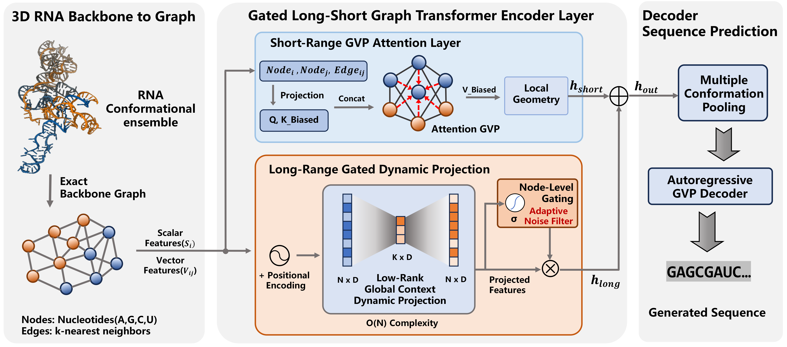
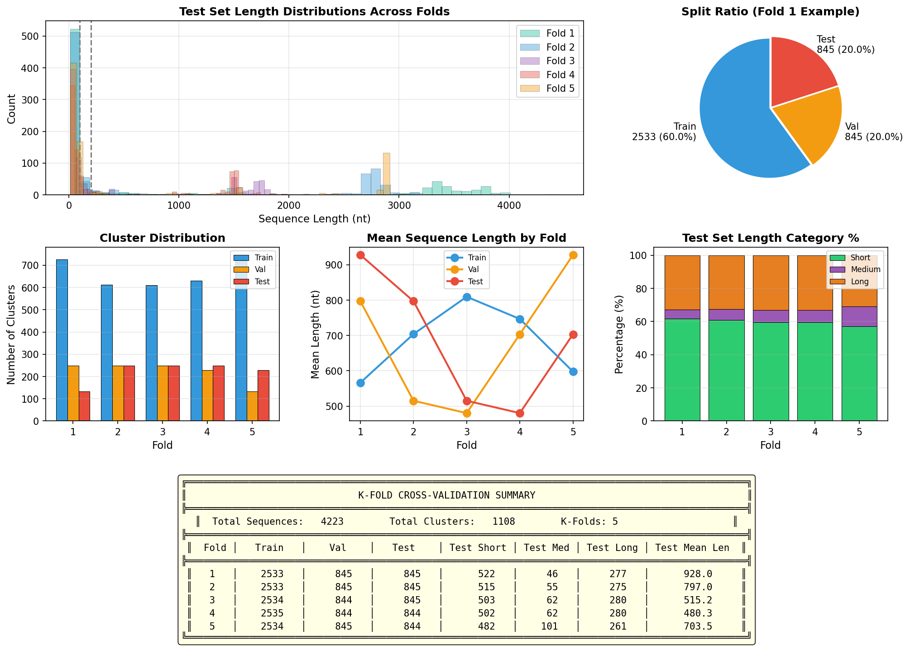

# GALS-Fold: Geometry-Aware Long-Short RNA Inverse Folding with Linear Complexity

<p align="center">
  <a href="#overview">Overview</a> •
  <a href="#installation">Installation</a> •
  <a href="#quick-start">Quick Start</a> •
  <a href="#architecture">Architecture</a> •
  <a href="#experiments">Experiments</a>
</p>


---

## Overview

**GALS-Fold** is a novel deep learning framework for RNA inverse folding—the task of designing RNA sequences that fold into a given 3D backbone structure. Unlike existing methods that suffer from either quadratic complexity (limiting scalability to long sequences) or loss of geometric precision (compromising design quality), GALS-Fold achieves **O(N) linear complexity** while preserving **SE(3)-equivariant geometric reasoning**.

<p align="center">
  
</p>


### Key Contributions

- **Dual-Stream Architecture**: Parallel short-range (local geometric) and long-range (global Interactions) branches that capture complex structural information.
- **Dynamic Projection Attention**: A novel asymmetric mechanism where clustering is efficient but retrieval preserves 3D directional sensitivity.
- **Length-Aware Gating and Gated Attention**: Dynamic fusion of local and global features based on sequence length, enabling optimal performance across diverse RNA sizes.
- **Local-Exclusion Auxiliary Loss**: Training objective that enforces long-range branch to focus on distant dependencies

---

## Installation

### Requirements

- Python ≥ 3.9
- PyTorch ≥ 2.0
- CUDA ≥ 11.8 (for GPU acceleration)

### Setup

Set up a python environment by following the installation instructions below. 
We have tested on Linux with Python 3.10.19 and CUDA 12.1 on NVIDIA A800 and 4090/5090 GPUs.

```bash
# Clone the repository
git clone https://github.com/wenxy59/GALS-Fold.git
cd GALS-Fold

# Create conda environment (recommended)
conda create -n galsfold python=3.10
conda activate galsfold

# Install PyTorch with CUDA 12.1 support
pip install torch==2.4.0+cu121 torchvision==0.19.0+cu121 torchaudio==2.4.0+cu121 \
    --index-url https://download.pytorch.org/whl/cu121

# Install PyTorch Geometric and extensions
pip install torch-geometric==2.7.0
pip install torch-scatter torch-cluster torch-sparse torch-spline-conv \
    -f https://data.pyg.org/whl/torch-2.4.0+cu121.html

# Install remaining dependencies
pip install -r requirements.txt
```

Next, install other compulsory dependencies:

```sh
# Install X3DNA for secondary structure determination
cd ~/GALS-Fold/tools/
tar -xvzf x3dna-v2.4-linux-64bit.tar.gz
./x3dna-v2.4/bin/x3dna_setup
# Follow the instructions to test your installation

# Install EternaFold for secondary structure prediction
cd ~/GALS-Fold/tools/
git clone --depth=1 https://github.com/eternagame/EternaFold.git && cd EternaFold/src
make

# Download RhoFold checkpoint
cd ~/GALS-Fold/tools/rhofold/
gdown https://drive.google.com/uc?id=1To2bjbhQLFx1k8hBOW5q1JFq6ut27XEv

# Download LinearFold
cd ~/GALS-Fold/tools/
git clone https://github.com/LinearFold/LinearFold.git
cd LinearFold
make
```

Then set up some extra tools and dependencies.

```sh
# (Optional) These tools are for data preprocessing and clustering
# Install CD-HIT for sequence identity clustering
conda install cd-hit -c bioconda

# Install US-align/qTMclust for structural similarity clustering
cd ~/GALS-Fold/tools/
git clone https://github.com/pylelab/USalign.git && cd USalign/ && git checkout 97325d3aad852f8a4407649f25e697bbaa17e186
g++ -static -O3 -ffast-math -lm -o USalign USalign.cpp
g++ -static -O3 -ffast-math -lm -o qTMclust qTMclust.cpp

```

Once your python environment is set up, create your `.env` file with the appropriate environment variables; see the .env.example file included in the codebase for reference. 

```sh
cd ~/GALS-Fold/
touch .env
```

In order to train your own models from scratch though, you still need to download and process raw RNA structures from RNAsolo.

## Quick Start

### Training

```bash
# you can just start training with wandb as follows:
python main.py --config configs/default.yaml split=kfold_1 model=GALS
# for training without wandb logging, run in background:
nohup python -u main.py --config configs/default.yaml split=kfold_1 model=GVPAtten --no_wandb > main.log 2>&1 &
```

### Evaluation

```bash
python evaluate.py model=GALS split=kfold_1 gpu=0

# Or you can start multiple processing
nohup sh -c 'python -u evaluate.py model=GALS split=kfold_5 > evalgals5.log 2>&1 ; python -u evaluate.py model=GVPAtten split=kfold_2 > evalgvpa2.log 2>&1 ; python -u evaluate.py model=GVPAtten split=kfold_3 > evalgvpa3.log 2>&1 ; python -u evaluate.py model=GVPAtten split=kfold_4 > evalgvpa4.log 2>&1 ; python -u evaluate.py model=GVPAtten split=kfold_5 > evalgvpa5.log 2>&1' &
```

## Architecture

GALS-Fold employs a **Dual-Stream Parallel Residual** architecture within each encoder layer:

```
                   Input: Node Features (Scalar + Vector)
                                    │
                 ┌──────────────────┴──────────────────┐
                 ▼                                     ▼
    ┌────────────────────────┐          ┌──────────────────────────────┐
    │      Short-Range       │          │         Long-Range           │
    │     (GVPAttention)     │          │  (Gated Dynamic Projection)  │
    └───────────┬────────────┘          └──────────────┬───────────────┘
                │                                      │
                └──────────────────┬───────────────────┘
                                   ▼
                        ┌────────────────────┐
                        │ Length-Aware Gating│
                        └──────────┬─────────┘
                                   ▼
                            Fused Features
```

### Short-Range Branch

- **GVP-Attention** on k-NN graph (k=32)
- Captures local features: bond lengths, angles, base stacking .etc
- Full SE(3)-equivariance preserved

### Long-Range Branch

- **Dynamic Projection Attention**: Projects N nodes → r anchors (r=32) to reduce complexity of attention capturing long interactions
- **Local-Exclusion Auxiliary Loss**: Training objective that enforces long-range branch to focus on distant dependencies

### Fusion Mechanism

- **Length-Aware Gating**: γ = σ((L - L₀)/τ) where L₀=150, τ=50
- Short sequences (L < 150): Primarily local features
- Long sequences (L > 150): Increased global context integration

---

## Experiments

### Metrics

| Metric       | Description                                                  |
| ------------ | ------------------------------------------------------------ |
| **Recovery** | Sequence identity between designed and native sequences      |
| **SC-Score** | Self-consistency: fold designed sequence, compare to target structure |

---

### Downloading and Preparing Data

The model is trained on all RNA structures from the PDB at ≤4A resolution downloaded via [RNASolo](https://rnasolo.cs.put.poznan.pl) with date cutoff: 31 October 2023.
Besides, you can download and extract the raw files via the following script into the `data/raw/` directory.
Alternatively to the instructions below, you can download a pre-processed [`.pt`](https://drive.google.com/file/d/1gcUUaRxbGZnGMkLdtVwAILWVerVCbu4Y/view?usp=sharing) file and [`.csv`](https://drive.google.com/file/d/1lbdiE1LfWPReo5VnZy0zblvhVl5QhaF4/view?usp=sharing) metadata, and place them into the `data/` directory.

```sh
# Download structures in PDB format from RNAsolo (31 October 2023 cutoff)
mkdir ~/GALS-Fold/data/raw
cd ~/GALS-Fold/data/raw
gdown https://drive.google.com/uc?id=10NidhkkJ-rkbqDwBGA_GaXs9enEBJ7iQ
tar -zxvf RNAsolo_31102023.tar.gz
```

Next, process the raw PDB files into ML-ready format, which will be saved under `data/processed.pt`. 

```sh
cd ~/GALS-Fold/
python data/process_data.py
```

Each RNA will be processed into the following format (most of the metadata is optional for inverse folding):

```python
{
    'sequence'                   # RNA sequence as a string
    'id_list'                    # list of PDB IDs
    'coords_list'                # list of structures, i.e. 3D coordinates of shape ``(length, 27, 3)``
    'sec_struct_list'            # list of secondary structure strings in dotbracket notation
    'sasa_list'                  # list of per-nucleotide SASA values
    'rfam_list'                  # list of RFAM family IDs
    'eq_class_list'              # list of non-redundant equivalence class IDs
    'type_list'                  # list of structure types (RNA-only, RNA-protein complex, etc.)
    'rmsds_list'                 # dictionary of pairwise C4' RMSD values between structures
    'cluster_seqid0.8'           # cluster ID of sequence identity clustering at 80%
    'cluster_structsim0.45'      # cluster ID of structure similarity clustering at 45%
}
```

---

### Split Methodology

We have provided the splits used in our experiments in the `data/` directory as `kfold_1_split.pt`.

We use RNA structures from the PDB, processed following k-fold strategy. In the experiments, 5-fold cross-validation with structure-based clustering ensures no data leakage and evaluates generalization performance.

<p align="center">
  
</p>


The scripts for creating and visualizing the splits can be found in the `data/` directory. The exact PDB IDs used for each test splits are also available in the `statistics/` directory.

---

## Configuration

Key hyperparameters in `configs/default.yaml`:

| Parameter          | Default   | Description                             |
| ------------------ | --------- | --------------------------------------- |
| `num_layers`       | 4         | Number of encoder/decoder layers        |
| `node_h_dim`       | [128, 16] | Hidden dimensions (scalar, vector)      |
| `num_anchors`      | 32        | Anchor points for long-range projection |
| `heads`            | 4         | Attention heads in short-range branch   |
| `length_threshold` | 150       | Length threshold for gating activation  |
| `aux_loss_weight`  | 0.3       | Weight for local-exclusion loss         |
| `drop_rate`        | 0.5       | Dropout rate                            |
| `lr`               | 1e-4      | Learning rate                           |

---

## Acknowledgments

This work builds upon several excellent open-source projects:

- [gRNAde](https://github.com/chaitjo/geometric-rna-design) - Geometric RNA Design
- [GVP](https://github.com/drorlab/gvp-pytorch) - Geometric Vector Perceptrons
- [Transformer-LS](https://github.com/NVIDIA/transformer-ls)- Long-Short Transformer (Transformer-LS)
- [RhoFold](https://github.com/ml4bio/RhoFold) - RNA Structure Prediction

---

## License

This project is licensed under the MIT License - see the [LICENSE](LICENSE) file for details.