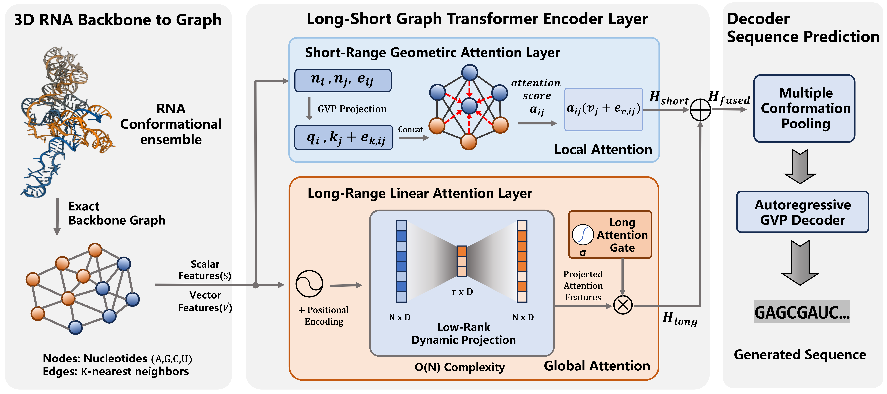
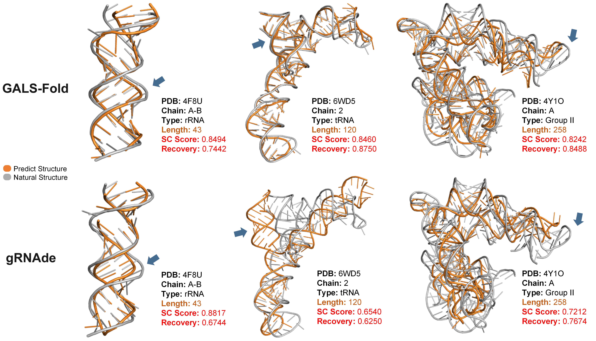
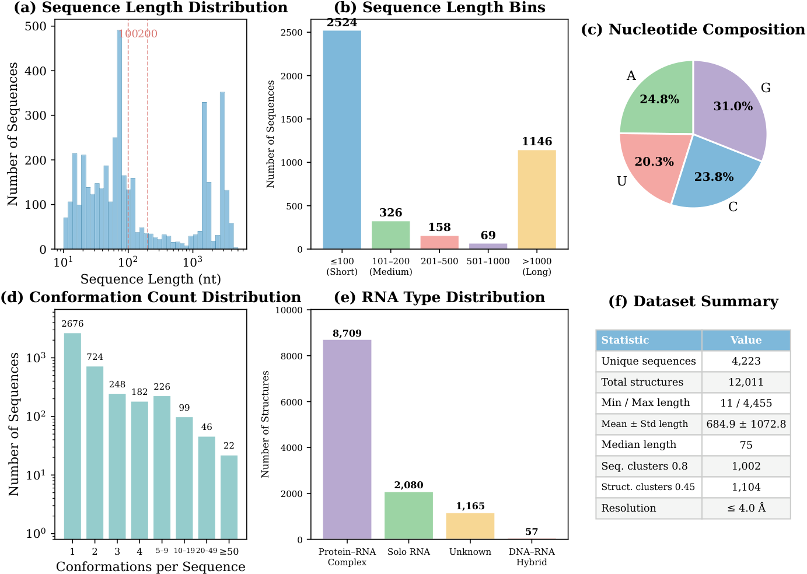
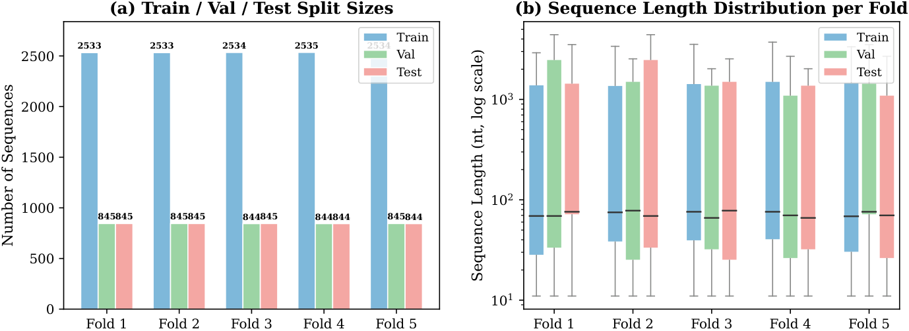

# GALS-Fold: Geometry-Aware Long-Short RNA Inverse Folding with Linear Scaling

<p align="center">
  <a href="#overview">Overview</a> •
  <a href="#installation">Installation</a> •
  <a href="#quick-start">Quick Start</a> •
  <a href="#experiments">Experiments</a>
</p>


---

## Overview

**GALS-Fold** is a geometry-aware long-short framework for RNA inverse folding: designing nucleotide sequences that adopt a prescribed 3D backbone. It addresses the “long RNA dilemma”: local geometric GNNs capture short-range motifs but struggle with long-range tertiary constraints, while global attention captures distant couplings but incurs quadratic cost. GALS-Fold combines an SE(3)-equivariant short-range encoder with a linear-time long-range module based on anchor attention, adds a local-exclusion regularization to emphasize non-local signals, and fuses long/short features with length-aware gating for scalability to long RNAs.

<p align="center">
  
</p>

---

## Installation

### Requirements

- Python ≥ 3.9
- PyTorch ≥ 2.0
- CUDA ≥ 11.8 (for GPU acceleration)

### Setup

Set up a python environment by following the installation instructions below. 
The experiments were conducted with Python 3.10.19 and CUDA 12.1 on RTX 4090 GPUs, with consistent results also observed on NVIDIA L40S and RTX 5090 GPUs under compatible CUDA environments.

```bash
# Clone the repository
git clone https://github.com/wenxy59/GALS-Fold.git
cd GALS-Fold

# Create conda environment (recommended)
conda create -n galsfold python=3.10 -y
conda activate galsfold

# Install all Python dependencies
python -m pip install --upgrade pip setuptools wheel
python -m pip install -r requirements.txt
```

Next, install other compulsory dependencies:

```sh
# Install X3DNA for secondary structure determination
cd ~/GALS-Fold/tools/
tar -xvzf x3dna-v2.4-linux-64bit.tar.gz
./x3dna-v2.4/bin/x3dna_setup
# Follow the instructions to test your installation

# Install EternaFold for secondary structure prediction
cd ~/GALS-Fold/tools/
git clone --depth=1 https://github.com/eternagame/EternaFold.git && cd EternaFold/src
make

# Download RhoFold checkpoint
cd ~/GALS-Fold/tools/rhofold/
gdown https://drive.google.com/uc?id=1To2bjbhQLFx1k8hBOW5q1JFq6ut27XEv

# Download LinearFold
cd ~/GALS-Fold/tools/
git clone https://github.com/LinearFold/LinearFold.git
cd LinearFold
make
```

Then set up some extra tools and dependencies.

```sh
# (Optional) These tools are for data preprocessing and clustering
# Install CD-HIT for sequence identity clustering
conda install cd-hit -c bioconda

# Install US-align/qTMclust for structural similarity clustering
cd ~/GALS-Fold/tools/
git clone https://github.com/pylelab/USalign.git && cd USalign/ && git checkout 97325d3aad852f8a4407649f25e697bbaa17e186
g++ -static -O3 -ffast-math -lm -o USalign USalign.cpp
g++ -static -O3 -ffast-math -lm -o qTMclust qTMclust.cpp

```

Once your python environment is set up, create your `.env` file with the appropriate environment variables; see the `.env_example` file included in the codebase for reference. 

```sh
cd ~/GALS-Fold/
touch .env
```
For the dataset, we use the same processed dataset as gRNAde. Please download it as follows:

```sh
cd ~/GALS-Fold/data
gdown --fuzzy 'https://drive.google.com/file/d/1gcUUaRxbGZnGMkLdtVwAILWVerVCbu4Y/view'
unzip processed.pt.zip
```
In order to train your own models from scratch though, you still need to download and process raw RNA structures from RNAsolo.

## Quick Start

### Training

```bash
# you can just start training as follows:
python main.py --config configs/default.yaml split=kfold_1 model=GALS

# enable wandb logging:
python main.py --config configs/default.yaml split=kfold_1 model=GALS --wandb
```

### Evaluation

```bash
python evaluate.py model=GALS split=kfold_1 gpu=0

# Or you can start multiple processing
nohup sh -c 'python -u evaluate.py model=GALS split=kfold_1 > evalgals1.log 2>&1 ; python -u evaluate.py model=GALS split=kfold_2 > evalgals2.log 2>&1 ; python -u evaluate.py model=GALS split=kfold_3 > evalgals3.log 2>&1 ; python -u evaluate.py model=GALS split=kfold_4 > evalgals4.log 2>&1 ; python -u evaluate.py model=GALS split=kfold_5 > evalgals5.log 2>&1' &
```
---

## Experiments

### Metrics

| Metric       | Description                                                  |
| ------------ | ------------------------------------------------------------ |
| **Recovery** | Sequence identity between designed and native sequences      |
| **SC-Score** | Self-consistency: fold designed sequence, compare to target structure |
| **TM-Score** | Tertiary-structure similarity between predicted and target backbones |
| **F1-Score** | Secondary-structure base-pair F1 between predicted and target structures |
| **GC-Content** | GC-content similarity between designed and native sequences |
| **k-mer Dist.** | KLD and R² between k-mer frequency distributions |
| **MFE** | Minimum free energy distribution alignment (thermodynamic plausibility) |
| **Complexity** | Inference time and peak memory vs. sequence length |

---

### Case Study

We visualize designed RNAs against native backbones using RhoFold predictions and pyMOL structural alignment. Across lengths, GALS-Fold designs align more closely with native conformations than the baseline, with clearer advantages on medium and long RNAs where long-range constraints dominate.

<p align="center">
  
</p>

---

### Data Files

- GALS-Fold Model checkpoints: `checkpoint/`
- Statistics tables (txt): `statistics/data/`
- Test FASTA archives: `statistics/testfasta/`
- Analysis notebook: `statistics/StatisticalNotebook.ipynb` (processes the statistics and FASTA artifacts)

### Downloading and Preparing Data

The model is trained on all RNA structures from the PDB at ≤4A resolution downloaded via [RNASolo](https://rnasolo.cs.put.poznan.pl) with date cutoff: 31 October 2023.
Besides, you can download and extract the raw files via the following script into the `data/raw/` directory.
Alternatively to the instructions below, you can follow the **Setup** instructions to download a pre-processed [`.pt`](https://drive.google.com/file/d/1gcUUaRxbGZnGMkLdtVwAILWVerVCbu4Y/view?usp=sharing) file and [`.csv`](https://drive.google.com/file/d/1lbdiE1LfWPReo5VnZy0zblvhVl5QhaF4/view?usp=sharing) metadata, and place them into the `data/` directory.

```sh
# Download structures in PDB format from RNAsolo (31 October 2023 cutoff)
mkdir ~/GALS-Fold/data/raw
cd ~/GALS-Fold/data/raw
gdown https://drive.google.com/uc?id=10NidhkkJ-rkbqDwBGA_GaXs9enEBJ7iQ
tar -zxvf RNAsolo_31102023.tar.gz
```

Next, process the raw PDB files into ML-ready format, which will be saved under `data/processed.pt`. 

```sh
cd ~/GALS-Fold/
python data/process_data.py
```

Each RNA will be processed into the following format (most of the metadata is optional for inverse folding):

```python
{
    'sequence'                   # RNA sequence as a string
    'id_list'                    # list of PDB IDs
    'coords_list'                # list of structures, i.e. 3D coordinates of shape ``(length, 27, 3)``
    'sec_struct_list'            # list of secondary structure strings in dotbracket notation
    'sasa_list'                  # list of per-nucleotide SASA values
    'rfam_list'                  # list of RFAM family IDs
    'eq_class_list'              # list of non-redundant equivalence class IDs
    'type_list'                  # list of structure types (RNA-only, RNA-protein complex, etc.)
    'rmsds_list'                 # dictionary of pairwise C4' RMSD values between structures
    'cluster_seqid0.8'           # cluster ID of sequence identity clustering at 80%
    'cluster_structsim0.45'      # cluster ID of structure similarity clustering at 45%
}
```

---

### Split Methodology

We have provided the splits used in our experiments in the `data/` directory as `kfold_1_split.pt`.

We use RNA structures from the PDB, processed following k-fold strategy. In the experiments, 5-fold cross-validation with structure-based clustering ensures no data leakage and evaluates generalization performance.

<p align="center">
  
</p>

<p align="center">
  
</p>


The scripts for creating and visualizing the splits can be found in the `data/` directory. The exact PDB IDs used for each test splits are also available in the `statistics/` directory.

---

## Configuration

Key hyperparameters in `configs/default.yaml`:

| Parameter          | Default   | Description                             |
| ------------------ | --------- | --------------------------------------- |
| `num_layers`       | 4         | Number of encoder/decoder layers        |
| `node_h_dim`       | [128, 16] | Hidden dimensions (scalar, vector)      |
| `num_anchors`      | 64        | Anchor points for long-range projection |
| `heads`            | 4         | Attention heads in short-range branch   |
| `length_threshold` | 150       | Length threshold for gating activation  |
| `aux_loss_weight`  | 0.3       | Weight for local-exclusion loss         |
| `drop_rate`        | 0.3       | Dropout rate                            |
| `lr`               | 3e-4      | Learning rate                           |

---

## Acknowledgments

This work builds upon several excellent open-source projects:

- [gRNAde](https://github.com/chaitjo/geometric-rna-design) - Geometric RNA Design
- [GVP](https://github.com/drorlab/gvp-pytorch) - Geometric Vector Perceptrons
- [Transformer-LS](https://github.com/NVIDIA/transformer-ls)- Long-Short Transformer (Transformer-LS)
- [RhoFold](https://github.com/ml4bio/RhoFold) - RNA Structure Prediction

---

## License

This project is licensed under the MIT License - see the [LICENSE](LICENSE) file for details.
